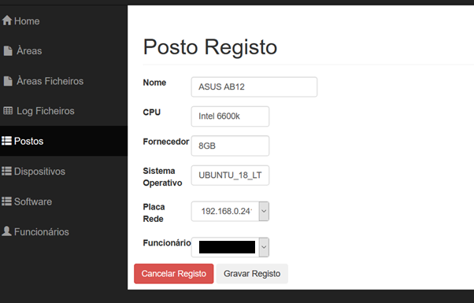
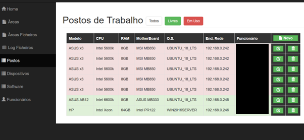
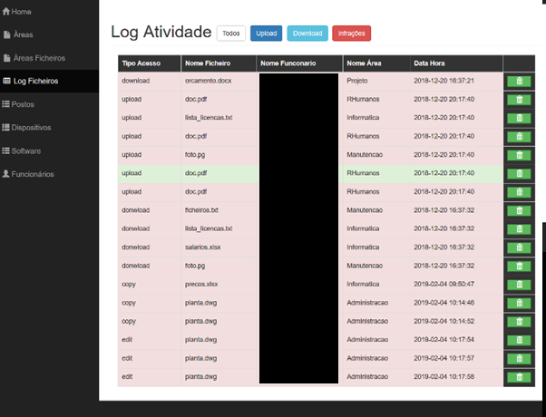
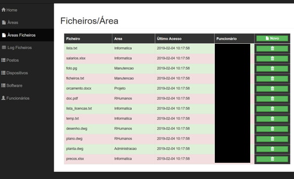

# ISPG_Gestor_IT_BDD
Projeto BDD curso engenharia Informática ISPGAYA

Projeto contém o Bootstrap 3 utilizado no projeto, juntamente com outras libraries. 
Montado em servidor Ubuntu20LTS com PHP7, apache2 e mysql, são necessárias extensões de PHP para uso do mysql e outros.

Exemplos de alguns paineis abaixo (nomes redacted):

Painel Ficheiros

  

Painel Atividade

  

Painel Postos

  

Painel Novo registo Posto

  

Pasta base de dados contém a base de dados exemplo.

Pasta doc contém um relatório sobre a aplicação. [link](docs/relatorio_funcao.pdf). 
